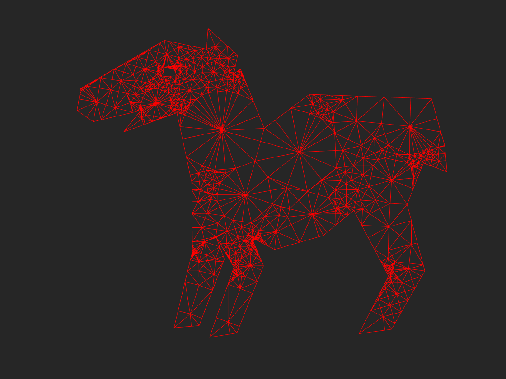
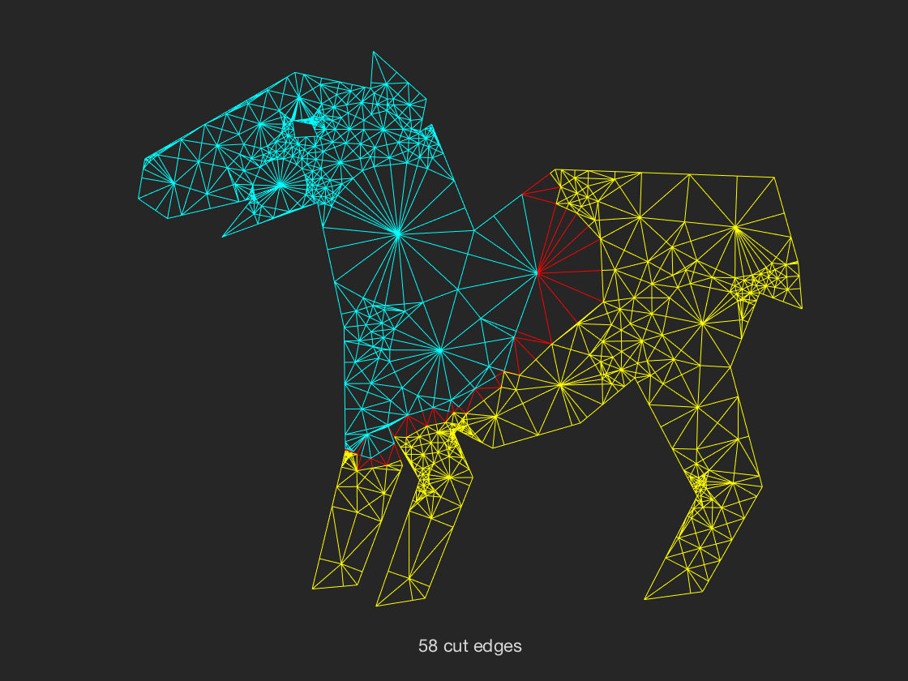
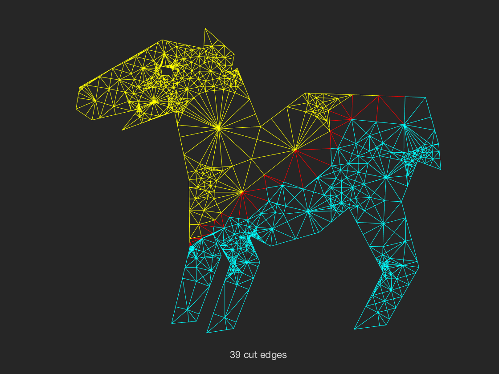
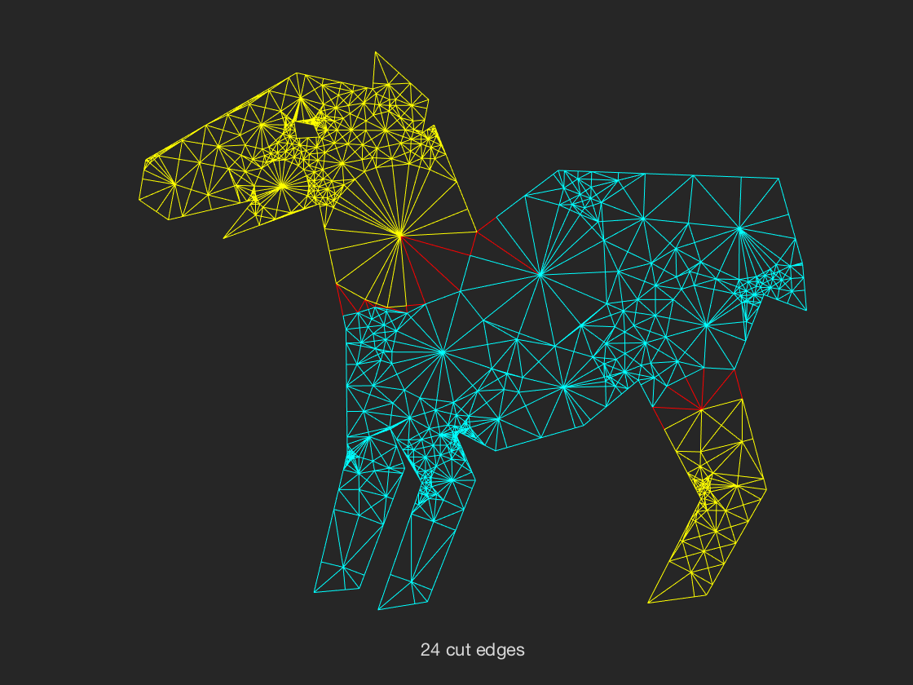
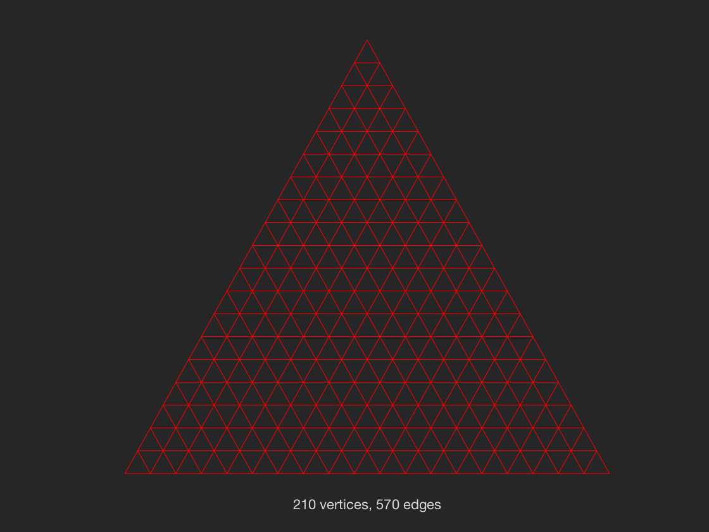
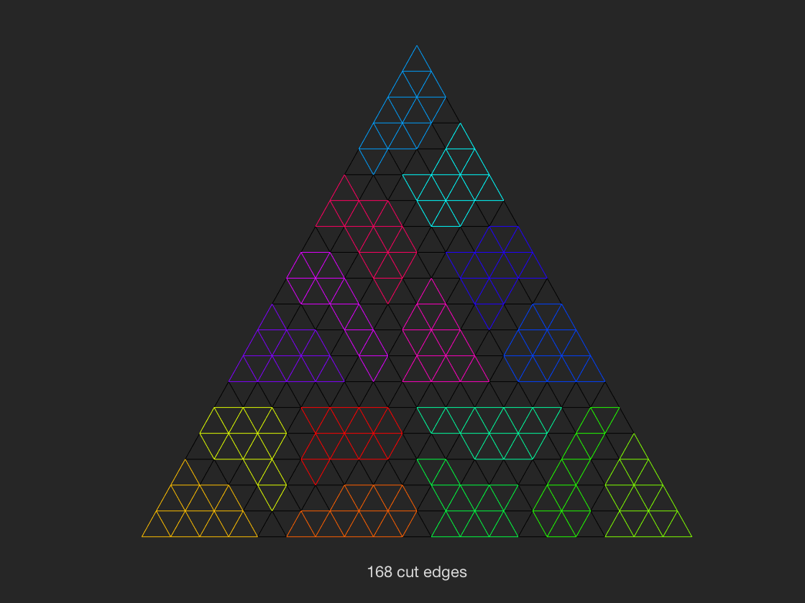
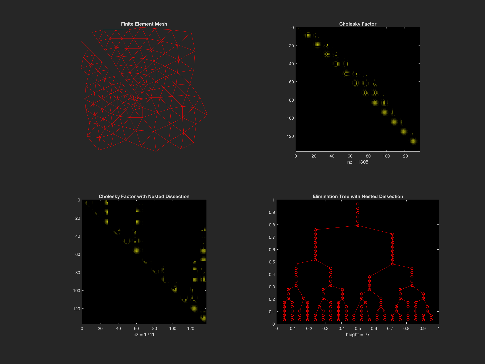

Mesh Partitioning Toolbox -- meshpart
==========================

This toolbox contains Matlab code for several graph and mesh partitioning
methods, including geometric, spectral, geometric spectral, and coordinate
bisection.  It also has routines to generate recursive multiway partitions, 
vertex separators, and nested dissection orderings; and it has some sample
meshes and mesh generators. 

Demonstrations
--------------------------

Tapir Graph |  Spectral Partition
:----------:|:-------------------------:
| 
**Geometric Partition** |  **Geometric Spectral Partition**
| 

Triangular Mesh |  Recursive Geometric Partition
:----------:|:-------------------------:
| 

Nested Dissection Reordering for Choleskey Factorization |
:----------:|
 |

  See "test/meshdemo" for detailed examples.

Contents
--------------------------

### Partitioning methods

| Name            | Description           |
|:--------------- |:--------------------- |
|  geopart        | Geometric.            |
|  specpart       | Spectral.             |
|  gspart         | Geometric spectral.   |
|  coordpart      | Coordinate bisection. |
|  inertpart      | Inertial bisection.   |

### Multiway partitions

| Name            | Description                                            |
|:--------------- |:------------------------------------------------------ |
|  dice           | Use any 2-way partitioner to get a multiway partition. |
|  geodice        | Recursive geometric partitioning.                      |
|  specdice       | Recursive spectral partitioning.                       |
|  gsdice         | Recursive geometric spectral partitioning.             |

### Vertex separators

| Name            | Description                                      |
|:--------------- |:------------------------------------------------ |
|  vtxsep         | Convert a 2-way partition to a vertex separator. |
|  geosep         | Vertex separator from geometric partitioning.    |
|  specsep        | Vertex separator from spectral partitioning.     |

### Nested dissection

| Name            | Description                                      |
|:--------------- |:------------------------------------------------ |
|  ndperm         | Use any 2-way partitioner for nested dissection. |
|  geond          | Geometric nested dissection ordering.            |
|  specnd         | Spectral nested dissection ordering.             |
|  gsnd           | Geometric spectral nested dissection ordering.   |

### Meshes and graph generators

| Name            | Description                                      |
|:--------------- |:------------------------------------------------ |
|  meshes.mat     | Three sample meshes with coordinates:            |
|  &nbsp;&nbsp;&nbsp;&nbsp; Eppstein   | A 2D finite-element mesh with 547 nodes.         |
|  &nbsp;&nbsp;&nbsp;&nbsp; Smallmesh  | A 2D finite-element mesh with 136 nodes.         |
|  &nbsp;&nbsp;&nbsp;&nbsp; Tapir      | A 2D finite-element mesh with 1024 nodes.        |
|  grid5          | 2D square 5-point mesh.                          |
|  grid7          | 2D square 7-point mesh.                          |
|  grid9          | 2D square 9-point mesh.                          |
|  gridt          | 2D triangular mesh.                              |
|  grid3d         | 3D cubical mesh.                                 |
|  grid3dt        | 3D cubical simplicial mesh.                      |
|  badmesh        | A mesh that has no good straight-line cut.       |
|  cockroach      | A mesh for which spectral bisection does poorly. |
|  treexpath      | A mesh for which spectral bisection does poorly. |
|  tree3xpath     | A mesh for which spectral bisection does poorly. |

### Visualization and graphics

| Name            | Description                                      |
|:--------------- |:------------------------------------------------ |
|  gplotpart      | Draw a 2-way partition.                          |
|  gplotmap       | Draw a multiway partition.                       |
|  ghighlight     | Draw a mesh with some vertices highlighted.      |
|  gplotg         | Draw a 2D or 3D mesh (replaces Matlab's gplot).  |
 
### Utilities

| Name            | Description                                              |
|:--------------- |:-------------------------------------------------------- |
|  analyze        | Predict fill, opcount, etc. for an elimination ordering. |
|  cutsize        | Find or count edges cut by a partition.                  |
|  fiedler        | Fiedler vector of a graph.                               |
|  contract       | Condense a graph according to a given block structure.   |
|  blockdiags     | Create matrix with specified block diagonals.            |

## References

* John R. Gilbert, Gary L. Miller, and Shang-Hua Teng.
  Geometric mesh partitioning:  Implementation and experiments.
  SIAM J. Scientific Computing 19:2091-2110, 1998.
  
* Tony F. Chan, John R. Gilbert, and Shang-Hua Teng.
  Geometric spectral partitioning.
  Xerox PARC Technical Report CSL-94-15, 1995.

* Bruce Hendrickson and Robert Leland.
  The Chaco user's guide, version 2.0.
  Sandia National Laboratories Technical Report SAND94-2692, 1994.

* George Karypis et al.
  METIS, Serial graph partitioning, version 4.0.1, November 1998.
  http://www.cs.umn.edu/~karypis/metis
  
* Robert Bridson.
  A MATLAB CMEX interface to the Metis library. 
  http://www.stanford.edu/~rbridson/download/metismex.c
  
* Yingzhou Li.
  MetisMex, A MATLAB Toolbox of interfaces to the Metis library. 
  https://github.com/YingzhouLi/metismex
  
## Authors
  
* John R. Gilbert, UC Santa Barbara, http://www.cs.ucsb.edu/~gilbert/

* Shang-Hua Teng, University of Southern California, http://www-bcf.usc.edu/~shanghua/ 

* Yingzhou Li, Stanford University, http://www.stanford.edu/people/yingzhouli
  
## Aknowledgement
 
  Thanks to Tim Davis for updating the toolbox to Matlab 5;
  to George Karypis, Vipin Kumar, and Robert Bridson for Metis 
  and its interface; and to Bruce Hendrickson and Robert Leland
  for Chaco in previous versions.
